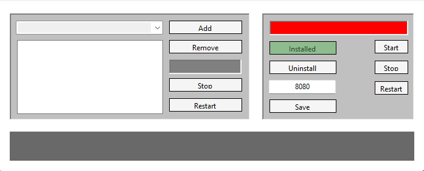

# ServiceMonitor


## Installation of Service Monitor

* Run ServiceMonitor.ControlPanel as admin
* Click the Install button on the right side of the panel 
* Set the port for the HTTPlistener (defaults to 8080)
* Click Save
* Click Start/Restart
* Browse to http://localhost:8080/status to confirm the listener works

The listener might not be able to open the port/socket - a url ACL must be added -example below:

```cmd
  Production: netsh http add urlacl url=http://+:8080/ user=DOMAIN\username   
  Testing: netsh http add urlacl url=http://+:8080/ user=DOMAIN\username   
```
    
## Adding services to Service Monitor
* Select service from the dropdown list on the left side of the panel 
* Click Add
* Repeat as required
* Click Save on the right side of the panel 
* Click Start/Restart on the right side of the panel 

## Features
* Monitoring service Installation status
* Monitoring service Uninstall handle 
* Custom port for HTTPlistener
* Monitoring service status "LED"  
* Monitoring service Start/Restart/Stop handles  
* Monitored service status "LED" 
* Monitored service  service Start/Restart/Stop handles
* Multiple services selectable
* JSON configuration

### In the making
- Branding
- Multiport support
- Better garbage cleaner (currently using cache mechanism for monitored service status)

### Made with love in :romania:   
